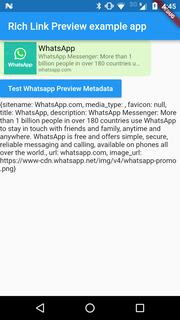

# link_preview



A Rich Link Preview flutter plugin.

## Usage
To use this plugin, add `link_preview` as a [dependency in your pubspec.yaml file](https://flutter.io/platform-plugins/).

### Example

``` dart
import 'package:flutter/material.dart';
import 'package:link_preview/link_preview.dart';

void main() {
  runApp(MaterialApp(
    home: Scaffold(
      body: Center(
      child: previwer.whatsAppLinkPreview(url: 'https://flutter.io'),
      ),
    ),
  ));
}
```